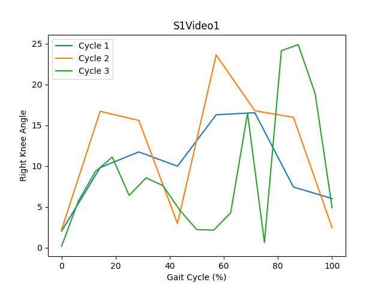
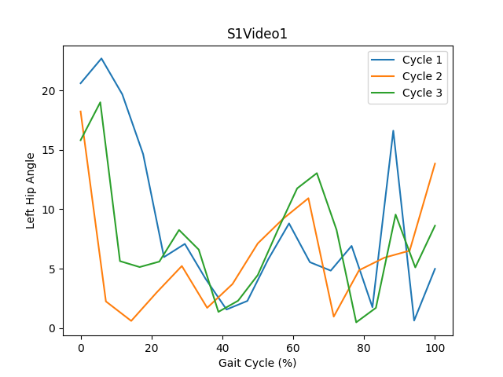
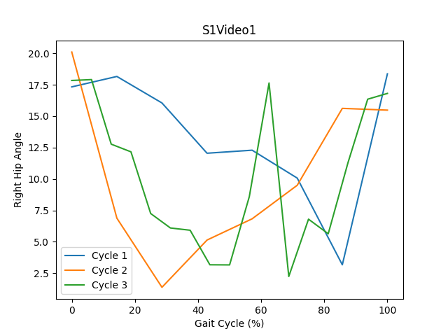

# Gait Analysis Using BlazePose
This project is about gait analysis with the help of laptop webcam or resource constrained computing devices such as mobile phone camera. The aim of this project is to classify the gait pattern as Normal or Abnormal or Near Abnormal using Bezier Curves. We are using hip, knee and ankle keypoints to find the Bezier curve of a particular leg of the subject(see the below figure).

### Range of Angles
In the below figure, each cycle represents the range of ankle angle for the left leg of the subject and gait cycle(%) represents a complete gait cylce which is the duration of the first heel strike to the second heel strike of the same leg. S1Video1 is the first video of the first subject. Each subject has two video recordings.

Similarly, for the other joints the figures are given below. 

Also, the performance on the laptop of the developed system is given in the Performance.xlsx file in the data folder.

